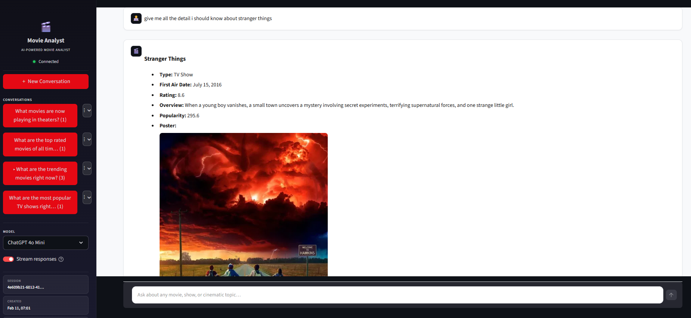
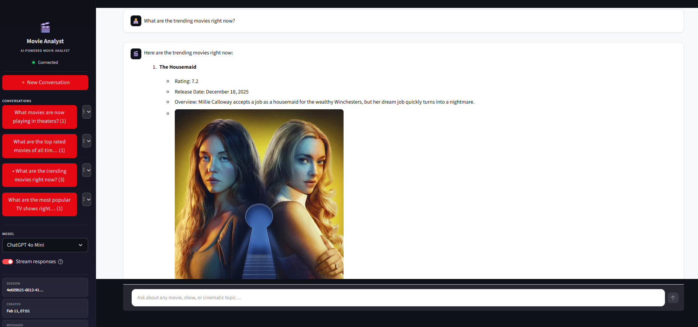

<p align="center">
  
  
  
  
  
</p>

<br>
<p align="center">
  
</p>

<h1 align="center">🎬 Movie Analyst Agent</h1>

<p align="center">
  <strong>An AI-powered cinematic research agent that delivers real-time movie &amp; TV intelligence<br>through an agentic ReAct loop with live TMDB data access.</strong>
</p>

<p align="center">
  <a href="#features">Features</a> •
  <a href="#architecture">Architecture</a> •
  <a href="#quick-start">Quick Start</a> •
  <a href="#api-reference">API</a> •
  <a href="#deployment">Deployment</a> •
  <a href="#concentrate-ai--known-shortcomings">Concentrate AI Notes</a>
</p>

---

## Overview

**Movie Analyst Agent** is a full-stack agentic application that combines a **LlamaIndex ReAct agent** with live data tools to answer any question about movies, TV shows, actors, and cinematic trends. Unlike simple chatbots that rely solely on pre-trained knowledge, this agent:

- **Reasons step-by-step** using the ReAct (Reasoning + Acting) framework
- **Calls live APIs** (TMDB, TVMaze) to fetch real-time data
- **Routes requests** through [Concentrate AI](https://concentrate.ai) to the best-fit LLM (GPT-4, Claude, Gemini)
- **Remembers context** across messages within each conversation session
- **Streams responses** word-by-word for a natural, real-time typing experience

---

## Preview

<p align="center">
  <video src="https://github.com/user-attachments/assets/project-overview.mp4" width="720" controls autoplay muted>
    Your browser does not support the video tag.
  </video>
</p>

> **Note:** If the video doesn't play above, [download project-overview.mp4](project-overview.mp4) or drag the file into a GitHub issue/comment to get a playable link, then replace the `src` URL above.

<p align="center">
  
</p>

<p align="center">
  
</p>

---

## Features

| Category | Details |
|---|---|
| **Agentic AI** | LlamaIndex ReAct agent with 12 specialized TMDB tools — search, discover, trending, details, similar, recommendations, and more |
| **Multi-Model** | Concentrate AI gateway with model selection (GPT-4, Claude 3.5, Gemini Pro, etc.) |
| **Streaming** | Server-sent events (SSE) with word-by-word delivery for real-time response rendering |
| **Multi-Chat** | Parallel conversation sessions with independent history and context |
| **Persistence** | Conversations saved to disk (JSON) + SQLite session tracking on the backend |
| **Memory** | In-process `Memory` objects cached per session so the agent retains full conversation context |
| **Cinema UI** | Dark-themed Streamlit interface with suggestion pills, hero landing page, and sidebar navigation |
| **Docker Ready** | Full `docker-compose.yml` for one-command deployment of backend + frontend |
| **Retry Logic** | Exponential backoff via Tenacity on all external API calls |

---

## Architecture

```
┌─────────────────────────────────────────────────────────────────┐
│                        Streamlit Frontend                       │
│  ┌──────────┐  ┌──────────────┐  ┌───────────┐  ┌───────────┐  │
│  │ Chat UI  │  │ Model Select │  │ Streaming │  │  Sidebar  │  │
│  └────┬─────┘  └──────┬───────┘  └─────┬─────┘  └───────────┘  │
│       └───────────────┼────────────────┘                        │
└───────────────────────┼─────────────────────────────────────────┘
                        │ HTTP / SSE
                        ▼
┌─────────────────────────────────────────────────────────────────┐
│                        FastAPI Backend                          │
│  ┌──────────┐  ┌──────────────┐  ┌──────────────────────────┐  │
│  │  Routes  │  │  Agent Cache │  │   Memory Cache (per      │  │
│  │ /chat    │──│  (per sess.) │──│   session, in-process)   │  │
│  │ /session │  └──────┬───────┘  └──────────────────────────┘  │
│  └──────────┘         │                                         │
│                       ▼                                         │
│            ┌─────────────────────┐                              │
│            │ LlamaIndex ReAct    │                              │
│            │ Agent (12 tools)    │                              │
│            └────────┬────────────┘                              │
│                     │                                           │
│          ┌──────────┼──────────┐                                │
│          ▼          ▼          ▼                                 │
│    ┌──────────┐ ┌────────┐ ┌────────┐                           │
│    │ TMDB API │ │TVMaze  │ │SQLite  │                           │
│    └──────────┘ └────────┘ └────────┘                           │
└─────────────────────────────────────────────────────────────────┘
                        │
                        ▼
            ┌─────────────────────┐
            │  Concentrate AI     │
            │  (Multi-LLM Router) │
            │  GPT-4 │ Claude │   │
            │  Gemini │ Auto   │  │
            └─────────────────────┘
```

---

## Tech Stack

| Layer | Technology |
|---|---|
| **Frontend** | Streamlit, Custom CSS (cinema dark theme) |
| **Backend** | FastAPI, Uvicorn, Pydantic Settings |
| **Agent** | LlamaIndex ReActAgent, Memory API |
| **LLM Gateway** | Concentrate AI (`api.concentrate.ai/v1`) |
| **Data Sources** | TMDB API v3, TVMaze API |
| **Database** | SQLAlchemy + SQLite |
| **HTTP Client** | HTTPX (async), Tenacity (retries) |
| **Containerization** | Docker, Docker Compose |

---

## Quick Start

### Prerequisites

- Python 3.11+
- [Concentrate AI](https://concentrate.ai) API key
- [TMDB](https://www.themoviedb.org/settings/api) API key

### 1. Clone

```bash
git clone https://github.com/<your-username>/movie-analyst.git
cd movie-analyst
```

### 2. Environment

Create `backend/.env`:

```env
CONCENTRATE_API_KEY=sk-cn-...
TMDB_API_KEY=your_tmdb_key
DEFAULT_MODEL=gpt-4o-mini        # or "auto" for smart routing
LOG_LEVEL=INFO
```

### 3A. Run with Docker (Recommended)

```bash
docker-compose up --build
```

| Service | URL |
|---|---|
| Frontend | [http://localhost:8501](http://localhost:8501) |
| Backend API | [http://localhost:8000](http://localhost:8000) |
| Health Check | [http://localhost:8000/health](http://localhost:8000/health) |

### 3B. Run Locally

```bash
# Backend
cd backend
pip install -r requirements.txt
uvicorn main:app --host 0.0.0.0 --port 8000 --reload

# Frontend (new terminal)
cd frontend
pip install -r requirements.txt
streamlit run app.py
```

---

## Project Structure

```
movie-analyst/
├── backend/
│   ├── main.py                     # Uvicorn entry point
│   ├── requirements.txt
│   ├── Dockerfile
│   └── src/
│       ├── api/
│       │   ├── main_app.py         # FastAPI app factory
│       │   └── routes.py           # /chat, /session endpoints
│       ├── core/
│       │   ├── config.py           # Pydantic Settings (validated)
│       │   ├── db.py               # SQLAlchemy + SQLite
│       │   └── logger.py           # Structured logging
│       ├── schemas/
│       │   └── chat.py             # Request / Response models
│       └── services/
│           ├── agent.py            # Agent factory + session cache
│           ├── concentrate_llm.py  # Concentrate AI LLM adapter
│           └── tool.py             # 12 TMDB / TVMaze tools
├── frontend/
│   ├── app.py                      # Streamlit application
│   ├── Dockerfile
│   ├── requirements.txt
│   └── static/
│       └── style.css               # Cinema dark theme
├── docker-compose.yml
└── .gitignore
```

---

## API Reference

### `POST /api/v1/chat`

Send a message to the agent.

```json
{
  "session_id": "uuid",
  "message": "What are the trending movies right now?",
  "model": "auto",
  "stream": true
}
```

**Non-streaming response:**

```json
{
  "content": "Here are the trending movies...",
  "session_id": "uuid"
}
```

**Streaming response:** Server-sent events — each chunk contains `{ "content": "..." }`, final event includes `"done": true`.

### `POST /api/v1/session/new`

Create a new conversation session. Returns `{ "session_id": "uuid" }`.

### `GET /api/v1/session/{session_id}`

Retrieve session metadata.

### `DELETE /api/v1/session/{session_id}`

Delete a session and its history.

### `GET /health`

Backend health check — returns `200 OK` when operational.

---

## Available Agent Tools

The ReAct agent has access to **12 specialized tools** that query live APIs:

| Tool | Description |
|---|---|
| `search` | Universal search across movies, TV shows, and people |
| `details` | Full details — credits, recommendations, metadata |
| `trending` | Currently trending content (day / week) |
| `popular` | Popular movies or TV shows |
| `top_rated` | Highest-rated content of all time |
| `upcoming` | Upcoming movie releases |
| `airing_today` | TV shows airing today |
| `on_the_air` | Currently airing TV series |
| `similar` | Find similar movies / shows |
| `recommendations` | TMDB-powered recommendations |
| `discover` | Advanced filtering (genre, year, rating, etc.) |
| `find_id` | Look up by external ID (IMDb, TVDB, etc.) |

---

## Configuration

All settings are managed via environment variables or `backend/.env`:

| Variable | Default | Description |
|---|---|---|
| `CONCENTRATE_API_KEY` | **required** | Concentrate AI gateway key |
| `TMDB_API_KEY` | **required** | TMDB API key |
| `DEFAULT_MODEL` | `gpt-4o-mini` | LLM model — `auto`, `gpt-4`, `claude-3-5-sonnet-20241022`, etc. |
| `AGENT_MEMORY_TOKEN_LIMIT` | `4000` | Max tokens in agent memory window |
| `MAX_OUTPUT_TOKENS` | `1000` | Max output tokens per response |
| `HTTP_TIMEOUT` | `60` | Request timeout in seconds |
| `HTTP_RETRIES` | `3` | Retry attempts on failure |
| `LOG_LEVEL` | `INFO` | Logging verbosity |
| `ALLOWED_ORIGINS` | `localhost:8501` | CORS origins (comma-separated) |

---

## Deployment

### Docker Compose (Production)

```bash
docker-compose up -d --build
```

Includes:

- **Health checks** with automatic restart on failure
- **Log rotation** — JSON driver, 10 MB × 3 files
- **Volume mounts** for persistent data
- **Network isolation** between services

---

## Concentrate AI — Known Shortcomings

> This section documents limitations and issues encountered while building with the [Concentrate AI](https://concentrate.ai) multi-model gateway. Listed here for reference and transparency.

| # | Issue |
|---|---|
| 1 | **Tooling model selection is unclear** — There’s no reliable way to choose whether a request should be handled by a tool-capable model vs a pure reasoning/chat model, which can lead to unexpected tool calls or missing tool support.            |
| 2 | **Not OpenAI-compatible out of the box** — The API surface is close, but not fully drop-in compatible with OpenAI-style clients/SDKs, so existing integrations often require code changes and custom wrappers.                                     |
| 3 | **Cannot fully disable tools** — Tool invocation can’t be cleanly turned off at the gateway level in all scenarios, making it hard to enforce “no-tools” execution for certain environments, tests, or compliance needs.                           |
| 4 | **`auto` features are unreliable** — The “auto” behavior does not consistently produce expected results (selection/routing/behavior varies), reducing confidence in production use without explicit model pinning.                                 |
| 5 | Streaming not working as expected — streaming responses returned empty output (no chunks/content) or failed to emit tokens despite successful request initiation   |
| 6 | **Lack of maintained framework adapters** — No official, maintained adapters for common ecosystems (LlamaIndex, LangChain, Vercel AI SDK, OpenAI Agents SDK compat mode), increasing setup friction and pushing integration burden onto end users. |
| 7 | **Higher support/maintenance overhead** — Because of compatibility gaps, tooling controls, and streaming variability, teams may need extra glue code, more tests, and more operational debugging compared to more standardized gateways.           |


**Screenshots:** Supporting screenshots are available in `./concentrate-api-issue/` for reference and reproducibility.

---

## Development

```bash
# Backend with hot-reload
cd backend && uvicorn main:app --reload --port 8000

# Frontend with hot-reload
cd frontend && streamlit run app.py

# Format
black backend/

```

---

## License

This project is for educational and personal use. TMDB data is provided under the [TMDB Terms of Use](https://www.themoviedb.org/documentation/api/terms-of-use).

---

<p align="center">
  Built with ☕ and a love for cinema<br>
  Powered by <a href="https://concentrate.ai">Concentrate AI</a> · <a href="https://www.themoviedb.org">TMDB</a> · <a href="https://docs.llamaindex.ai">LlamaIndex</a>
</p>
